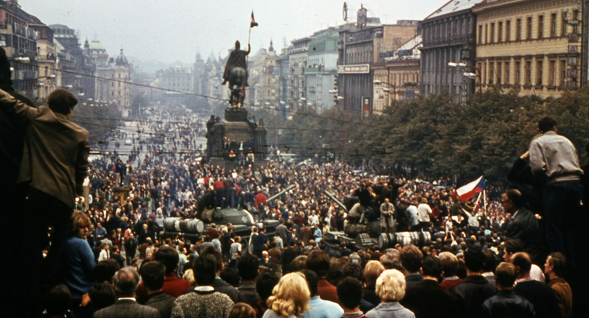

 

 

# {.tabset .tabset-fade}

## Discussion

---

<h4>*Week 1*</h4>

---

Why study Eastern Europe?

*The East-West border is always wandering, sometimes eastward, sometimes west, and we do not know exactly where it is just now...* (Jaan Kaplinski, 1987)

Two German words: the hegemony of 'Mitteleuropa' versus the pluralism of 'Zwischeneuropa'

* Legacies of Empire
* Legacies of Communism
* Political Economy
* Democratization
* Democratic Backsliding
* Identity (nation, ethnicity, religion, language, etc.)
* Corruption
* Geopolitics (EU and Russia)
* Parties and populism
* Variation

## News

---

<h4>*How to keep track of (Eastern) European politics:*</h4>

---

[RFERL](https://www.rferl.org) – Central and Eastern European reporting

[New Eastern Europe](http://neweasterneurope.eu) – Eastern European reporting

[Carnegie Europe](http://carnegieeurope.eu) - policy reporting from Europe

[Carnegie Moscow Center](https://carnegie.ru/?lang=en) - policy reporting from Russia

[Meduza News](https://meduza.io/en) – objective Russian news from Latvia for English speakers

[The Moscow Times](https://themoscowtimes.com) -- Western oriented reporting from the heart of Russia

[Politico Europe](https://www.politico.eu) -- reporting on Europe

[Foreign Policy](https://foreignpolicy.com) -- articles on global foreign policy

[EurActiv](https://www.euractiv.com) -- EU news and more EU news

[Reuters](https://www.reuters.com) -- international reporting

[Vox Europe](https://voxeurop.eu/en) -- addressing urgent European affairs

[Calvert Journal](http://www.calvertjournal.com) -- Eastern European culture (music, art, literature, photography, architecture)

