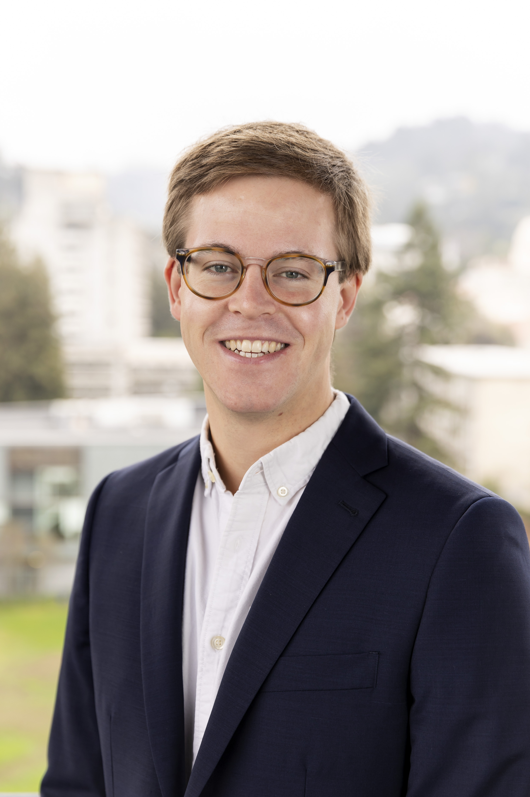

---

<h5>Ph.D. Candidate in Political Science, University of California, Berkeley</h5>

---

**Otto Kienitz** is a Ph.D. Candidate in Political Science at the University of California, Berkeley.

His ***research interests*** include the study of democracy & autocracy, state-building & state capacity, and local taxation & representation in comparative perspective. He is an expert in Russian politics, including local politics, public goods provision,  electoral authoritarianism, historical legacies, and the historical political economy of the Russian Empire.

His ***Ph.D. dissertation*** examines local democratization as state-building, identifying the relationship between local taxation and representation in weak states such as the nineteenth century Russian Empire, Ottoman Empire, and Qing Dynasty in historical comparative perspective. His other work explores the historical political economy of state-building with a focus on the role of local elites in constraining or enabling state-building and the development of state capacity over time and space.

He is the co-founder of the Berkeley ***Historical Social Science Workshop (HSSW)*** and is an advocate for mixed-methods approaches to the study of historical political economy emerging from his training as a historian and his experience with qualitative archival research and the historiography of empire.

Prior to attending Berkeley, he received his B.A. (Phi Beta Kappa, Summa Cum Laude) in History with a Minor in Political Science from the [University of Pennsylvania](https://www.upenn.edu), and an M.A. in Russian and Eurasian Studies from the [European University at St. Petersburg](https://eu.spb.ru/en/) (Russia), and holds an M.A. in Political Science with Distinction from the [University of California, Berkeley](https://www.berkeley.edu).

He comes from a family of musicians, educators, and writers. His grandfather, Richard C. Kienitz, won a Pulitzer Prize for Public Service with the Milwaukee Journal Sentinel in 1967 for his reporting on water pollution in Wisconsin.

---

His full CV is available [here](cv.html) and can be reached via [email](mailto:ojk@berkeley.edu).

---

There are things / we live among / and to see them / is to know ourselves.

*George Oppen, Of Being Numerous (1968)*

 

*Russian land grant charter on 17th century vellum*